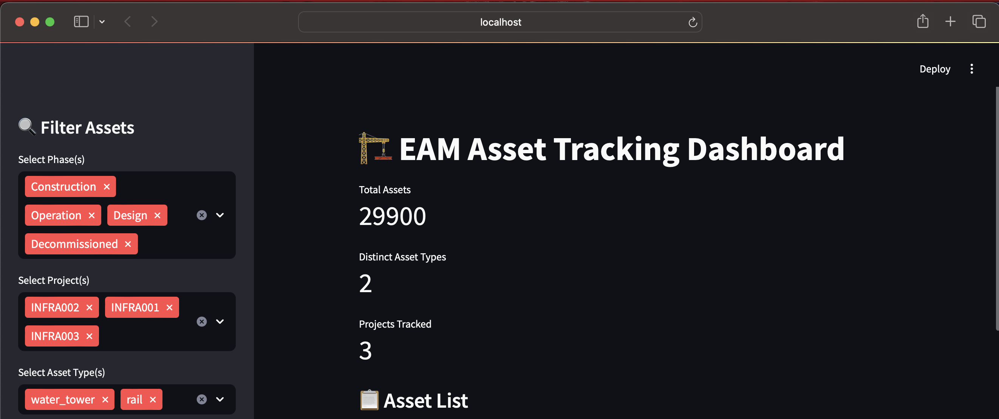
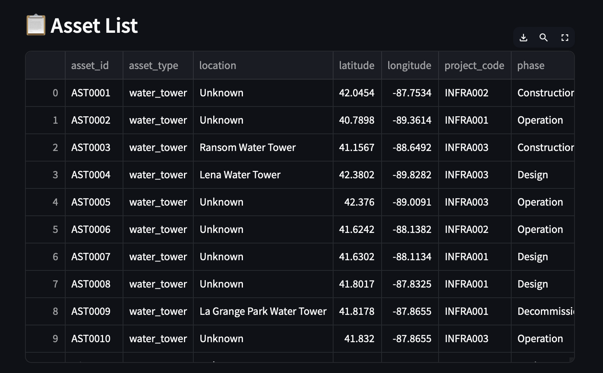
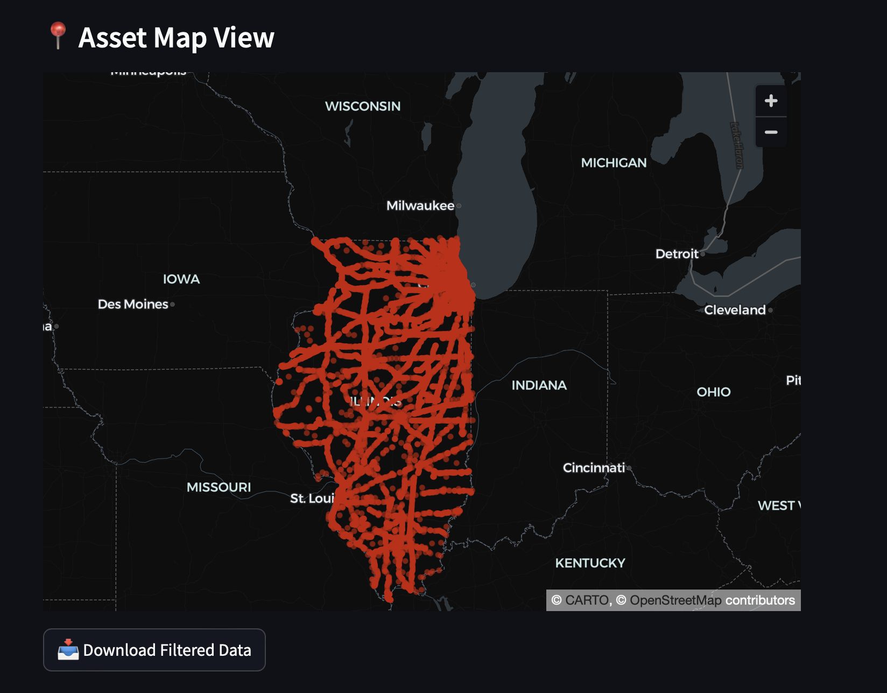

# EAM-Based Asset Tracking System for Infrastructure Projects

A full-stack simulation of an **Enterprise Asset Management (EAM)** platform that enables the tracking, auditing, and visualization of infrastructure assets across lifecycle phases such as Design, Construction, Operation, and Decommissioning. Powered by OpenStreetMap data, SQLite, and Streamlit.

---

## Features

- ✅ Extract real infrastructure assets from OSM shapefiles (Geofabrik)
- ✅ Simulate lifecycle phases, installation dates, and project codes
- ✅ Load structured data into a SQLite database
- ✅ Run SQL-based phase and project-level asset reports
- ✅ Interactive Streamlit dashboard with filters, maps, and CSV export
- ✅ Suitable for use case demos, asset validation, or audit simulations

---

## Project Structure
``
transit-safety-analytics/
│── data                            
│   ├── gis_osm_buildings_a_free_1.sh       # Shapefiles from Geofabrik 
│   ├── .....
│   ├── ....
│   │── infrastructure_assets.csv           # Extracted filtered OSM assets
│   │── asset_registry_with_phases.csv      # Final EAM-enriched dataset
│── database
│   ├── eam_assets.db                       # SQLite database with 'assets' table
│── extract_assets_from_osm.py              # Parses shapefiles to CSV
│── load_assets_to_db.py                    # Loads into SQLite 
│── query_asset_reports.py                  # SQL-based analytics
│── simulate_asset_phases.py                # Adds phases, status, and date
│── streamlit_dashboard.py                  # Interactive dashboard app 
│── requirements.txt                        # Python dependencies
│── README.md                               # Project documentation
```

## Installation

1. Clone the repository:
   ```bash
   gh repo clone Sarthak2403/Asset_Failure_Prediction_System
   cd Asset_Failure_Prediction_System

2. Create a virtual environment:
   ```bash
   python -m venv venv
   source venv/bin/activate  # On Windows use `venv\Scripts\activate`
   ```
3. Install dependencies:
   ```bash
   pip install -r requirements.txt
   ```

4. Download the data from:
```
https://download.geofabrik.de/north-america/us.html
```

## Usage
1. Extract Asset Data from OSM:
```
python extract_assets_from_osm.py
```

2. Simulate Asset Lifecycle:
```
python simulate_asset_phases.py
```

3. Load into SQLite:
```
python load_assets_to_db.py
```

4. Run SQL Analytics:
```
python query_asset_reports.py
```

5. Launch the dashboard
To launch the dashboard, run:
```bash
streamlit run streamlit_app.py
```

6. Access the dashboard in your browser at http://localhost:8051

## Outputs

- 📊 Assets by Phase :-

```
            phase  count
0       Operation  11983
1    Construction   8981
2          Design   5955
3  Decommissioned   2981
```

- 🏗️ Assets by Type and Project :-

```
  project_code   asset_type  count
0     INFRA001         rail   9622
1     INFRA001  water_tower    322
2     INFRA002         rail   9667
3     INFRA002  water_tower    310
4     INFRA003         rail   9669
5     INFRA003  water_tower    310 
```

- 📌 Top 5 Asset Types :-

```
    asset_type  count
0         rail  28958
1  water_tower    942 
```
- Dashboard App:





